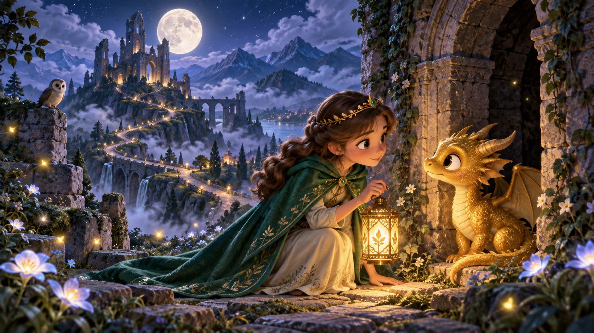
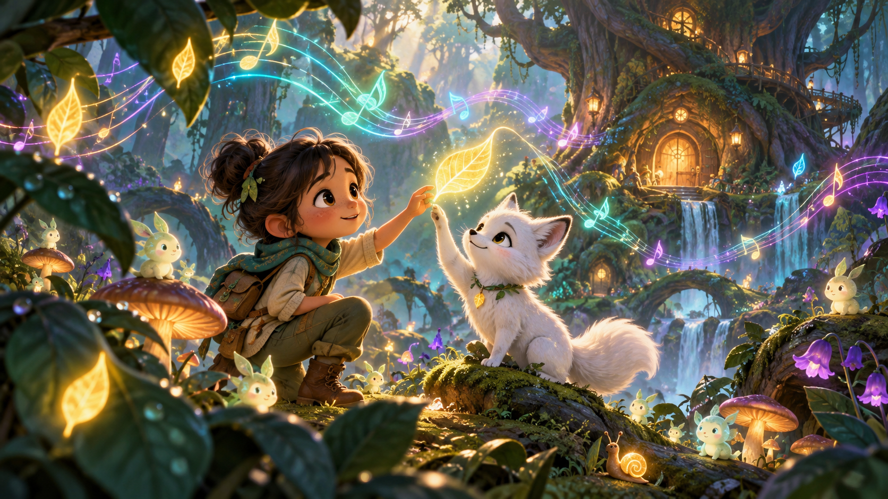
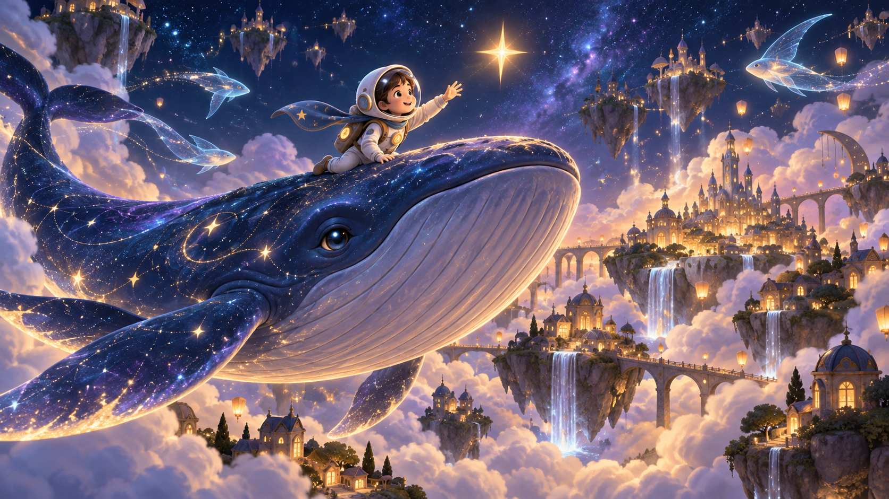
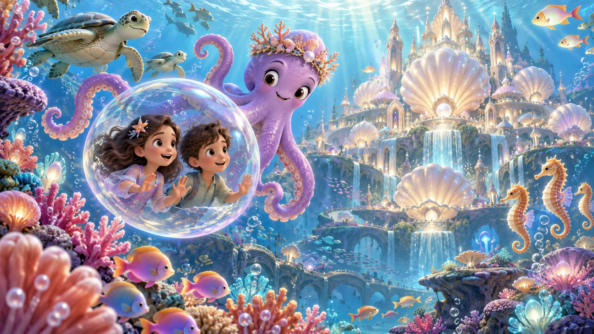

# WonderBook story previews — round 1

Four original 16:9 story-selection references generated with the built-in image-generation workflow. The shared direction is premium cinematic family animation with classic hand-painted fairytale warmth. The images contain no titles, logos, or interface elements.

## 1. The Princess and the Moon Dragon



```text
Use case: illustration-story
Asset type: immersive story preview artwork for a children's bedtime storytelling app
Primary request: Create an original magical scene titled conceptually "The Princess and the Moon Dragon."
Scene/backdrop: Moonlit castle ruins high in soft blue mountains, surrounded by glowing wildflowers, fireflies, drifting clouds, and a winding path.
Subject: An original young princess in an emerald-green cape discovers a small gentle golden dragon hiding beside an ancient archway. She holds a warm magical lantern; they look at each other with curiosity and trust, never fear.
Style/medium: premium cinematic family-animation fairytale illustration, classic hand-painted storybook warmth combined with polished dimensional character animation, expressive staging, luminous color, graceful shapes, rich environmental storytelling, original visual identity.
Composition/framing: 16:9 wide cinematic establishing shot, characters prominent in the foreground, layered scenery and a winding path pulling the viewer deep into the world; suitable as an app story-selection preview.
Lighting/mood: luminous moonlight mixed with warm gold lantern light, soft volumetric atmosphere, wonder, tenderness, safe bedtime adventure.
Color palette: midnight blue, emerald, moonlit lavender, warm gold.
Constraints: entirely original characters and costume design; child-safe; immersive depth; no text, no title, no logo, no UI, no watermark.
Avoid: recognizable copyrighted characters, franchise-specific motifs, photorealism, horror, menace, sharp weapons, cluttered composition.
```

## 2. The Forest That Learned to Sing



```text
Use case: illustration-story
Asset type: immersive story preview artwork for a children's bedtime storytelling app
Primary request: Create an original magical scene titled conceptually "The Forest That Learned to Sing."
Scene/backdrop: An enchanted forest where leaves glow like musical notes, tiny luminous creatures gather among mushrooms, and an ancient tree contains a softly lit round doorway.
Subject: An original young explorer and a small white fox touch a floating glowing leaf together as visible ribbons of colored music ripple through the trees.
Style/medium: premium cinematic family-animation fairytale illustration, classic hand-painted storybook warmth combined with polished dimensional character animation, expressive staging, luminous color, graceful shapes, rich environmental storytelling, original visual identity.
Composition/framing: 16:9 wide immersive view from inside the forest, foreground leaves close to camera, the child and fox as the clear focal point, deep layers of foliage drawing the viewer toward the glowing tree; suitable as an app story-selection preview.
Lighting/mood: soft warm sunbeams through teal mist, magical bioluminescent accents, playful discovery, cozy and safe.
Color palette: forest green, turquoise, violet, soft amber.
Constraints: entirely original characters; child-safe; immersive depth; no text, no title, no logo, no UI, no watermark.
Avoid: recognizable copyrighted characters, franchise-specific motifs, photorealism, darkness that feels threatening, clutter, neon cyberpunk styling.
```

## 3. The City Beneath the Stars



```text
Use case: illustration-story
Asset type: immersive story preview artwork for a children's bedtime storytelling app
Primary request: Create an original magical scene titled conceptually "The City Beneath the Stars."
Scene/backdrop: A boundless night sky filled with floating islands and a small city built among clouds, glowing with hundreds of warm lanterns; translucent sky fish leave delicate trails of light.
Subject: An original young astronaut in a soft rounded suit rides on the back of an enormous gentle cosmic whale, reaching toward a nearby star as the whale glides toward the cloud city.
Style/medium: premium cinematic family-animation fairytale illustration, classic hand-painted storybook warmth combined with polished dimensional character animation, expressive staging, luminous color, graceful shapes, rich environmental storytelling, original visual identity.
Composition/framing: 16:9 epic wide shot with the whale sweeping diagonally through the frame, strong sense of flight and scale, layered clouds and islands creating extraordinary depth; suitable as an app story-selection preview.
Lighting/mood: dreamy starlight, warm city glow below, quiet awe, freedom and bedtime wonder.
Color palette: deep indigo, violet, celestial blue, warm lantern gold.
Constraints: entirely original character, whale, suit, and city design; child-safe; immersive depth; no text, no title, no logo, no UI, no watermark.
Avoid: recognizable copyrighted characters, franchise-specific spacecraft, photorealism, hard science-fiction machinery, danger, combat, visual clutter.
```

## 4. The Hidden Kingdom Beneath the Sea



```text
Use case: illustration-story
Asset type: immersive story preview artwork for a children's bedtime storytelling app
Primary request: Create an original magical scene titled conceptually "The Hidden Kingdom Beneath the Sea."
Scene/backdrop: A vast underwater kingdom built inside giant pearlescent shells, surrounded by coral gardens, glowing fish, seahorses, and slow-moving sea turtles.
Subject: Two original young siblings travel inside a transparent magical bubble while a friendly lavender octopus wearing a delicate coral crown guides them toward the shell palace.
Style/medium: premium cinematic family-animation fairytale illustration, classic hand-painted storybook warmth combined with polished dimensional character animation, expressive staging, luminous color, graceful shapes, rich environmental storytelling, original visual identity.
Composition/framing: 16:9 wide underwater view, coral and fish close to camera for immersion, bubble and octopus in the middle ground, magnificent shell palace in the distance; suitable as an app story-selection preview.
Lighting/mood: sunbeams filtering through clear water, pearlescent glow, gentle movement, welcoming discovery and safe adventure.
Color palette: aqua, coral pink, seafoam, lavender, pearl gold.
Constraints: entirely original characters and kingdom design; child-safe; immersive depth; no text, no title, no logo, no UI, no watermark.
Avoid: recognizable copyrighted characters, franchise-specific motifs, photorealism, deep-sea horror, predators, danger, murky water, cluttered composition.
```
