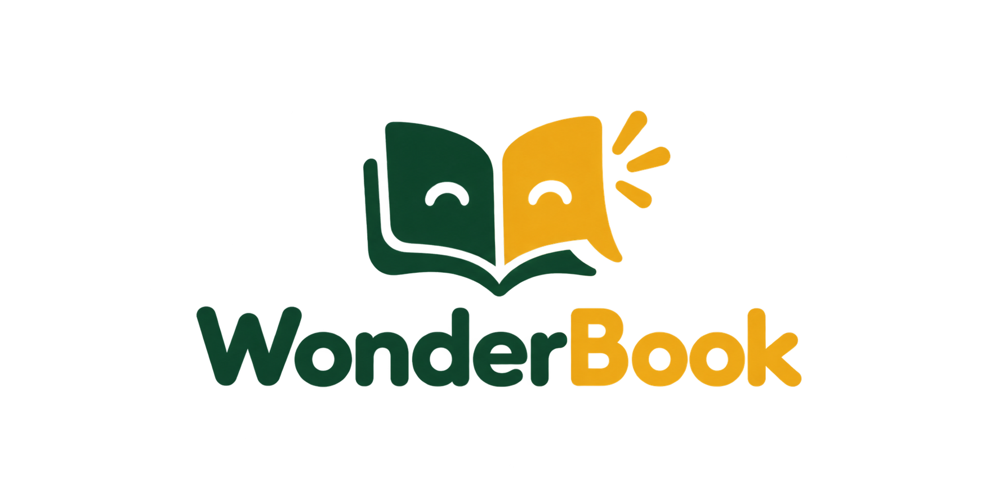
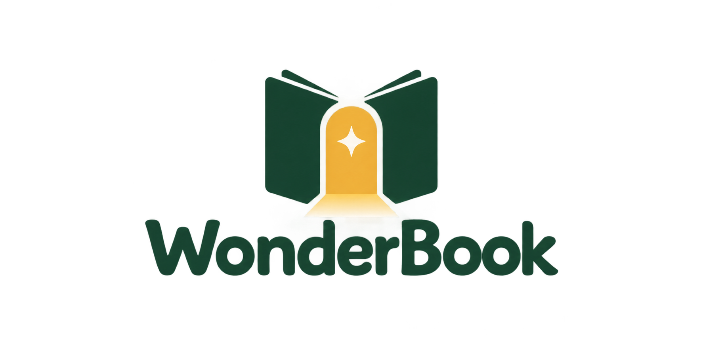
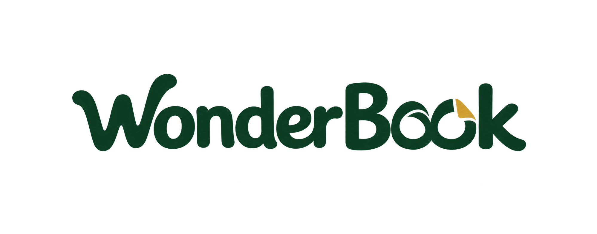
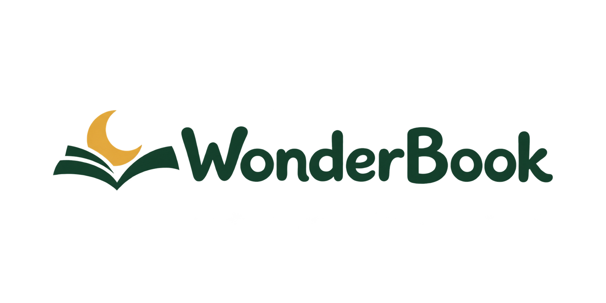
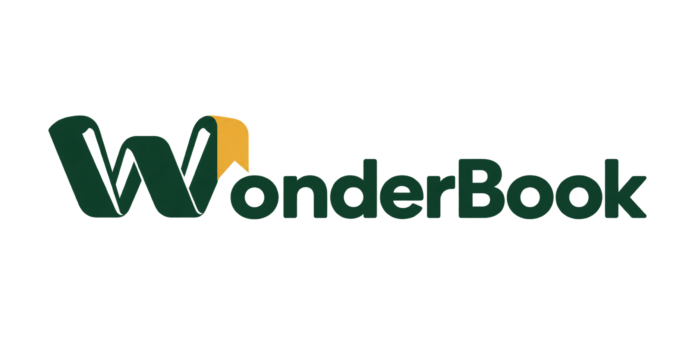

# WonderBook — five logo directions, round 2

Created 2026-09-12 with five separate built-in image-generation calls. Model version is not exposed by the tool. These are raster design explorations, not editable vectors or legally cleared marks. The user rejected v1; none of these alternatives has been selected or integrated into the app. Original files and v1 are preserved.

The requested pull was completed first on julian: origin/main fast-forwarded from ad6e904 to de5706a. No switch to main, merge commit, push, or app-logo replacement was performed.

## Options

### 1. Libro que habla



[PNG asset](../public/brand/wonderbook-round2/01-talking-book.png)

#### Exact generation prompt

```text
Use case: logo-brand. Create ONE new original logo concept for "WonderBook", a voice-interactive bedtime fairy-tale web app for American families. Exact text "WonderBook", spelled W-o-n-d-e-r-B-o-o-k with capital W and B. Make the logo legible, memorable, contemporary, and genuinely charming for children and parents. Clean flat vector-like shapes rendered as a high-resolution raster logo. Strong silhouette, professional optical spacing. Compact horizontal lockup centered on a warm off-white background, generous clear margin. Deep forest green with warm golden accent as in the project, high contrast. This is a logo exploration, not an illustration, not a generic library logo. No slogan, no numbering, no annotation, no extra text, no duplicate logos, no mockup, no texture, no 3D, no watermark. Avoid the previously explored heavy traditional serif wordmark with a conventional open-book-and-star icon.
Concept: a witty compact symbol merging a rounded speech bubble and two simplified open-book pages in one continuous silhouette. The bubble's tail becomes a page corner. Visually convey a book that listens and talks without microphone symbols. Accompany with a friendly rounded sans-serif wordmark with open counters. Minimal, playful, digital-first, striking enough for an app icon. Do not place a star above an ordinary book.
```

### 2. Portal mágico



[PNG asset](../public/brand/wonderbook-round2/02-magic-door.png)

#### Exact generation prompt

```text
Use case: logo-brand. Create ONE new original logo concept for "WonderBook", a voice-interactive bedtime fairy-tale web app for American families. Exact text "WonderBook", spelled W-o-n-d-e-r-B-o-o-k with capital W and B. Make the logo legible, memorable, contemporary, and genuinely charming for children and parents. Clean flat vector-like shapes rendered as a high-resolution raster logo. Strong silhouette, professional optical spacing. Compact horizontal lockup centered on a warm off-white background, generous clear margin. Deep forest green with warm golden accent as in the project, high contrast. This is a logo exploration, not an illustration, not a generic library logo. No slogan, no numbering, no annotation, no extra text, no duplicate logos, no mockup, no texture, no 3D, no watermark. Avoid the previously explored heavy traditional serif wordmark with a conventional open-book-and-star icon.
Concept: a slightly open upright book cleverly forming an arched doorway into imagination. The bright golden negative-space door is the central surprise, bounded by two simple green book-cover shapes, no landscape or scene within. Pair with a soft humanist wordmark, subtly rounded, not chunky or ornate. Evoke discovery and invitation. Bold, minimal, distinctive silhouette.
```

### 3. Tipografía juguetona



[PNG asset](../public/brand/wonderbook-round2/03-playful-wordmark.png)

#### Exact generation prompt

```text
Use case: logo-brand. Create ONE new original logo concept for "WonderBook", a voice-interactive bedtime fairy-tale web app for American families. Exact text "WonderBook", spelled W-o-n-d-e-r-B-o-o-k with capital W and B. Make the logo legible, memorable, contemporary, and genuinely charming for children and parents. Clean flat vector-like shapes rendered as a high-resolution raster logo. Strong silhouette, professional optical spacing. Compact horizontal lockup centered on a warm off-white background, generous clear margin. Deep forest green with warm golden accent as in the project, high contrast. This is a logo exploration, not an illustration, not a generic library logo. No slogan, no numbering, no annotation, no extra text, no duplicate logos, no mockup, no texture, no 3D, no watermark. Avoid the previously explored heavy traditional serif wordmark with a conventional open-book-and-star icon.
Concept: typography-led wordmark, no separate icon. Build a delightfully custom rounded wordmark: the two adjacent o letters in Book suggest two connected turning pages using a small elegant fold cut, without disrupting readability. A single golden page-corner accent integrated into the lettering. Very subtle lively letter rhythm, exceptionally clean curves, effortless reading. Not a heavy traditional serif, no unrelated illustration. The letters themselves are the identity.
```

### 4. Luna de cuentos



[PNG asset](../public/brand/wonderbook-round2/04-bedtime-moon.png)

#### Exact generation prompt

```text
Use case: logo-brand. Create ONE new original logo concept for "WonderBook", a voice-interactive bedtime fairy-tale web app for American families. Exact text "WonderBook", spelled W-o-n-d-e-r-B-o-o-k with capital W and B. Make the logo legible, memorable, contemporary, and genuinely charming for children and parents. Clean flat vector-like shapes rendered as a high-resolution raster logo. Strong silhouette, professional optical spacing. Compact horizontal lockup centered on a warm off-white background, generous clear margin. Deep forest green with warm golden accent as in the project, high contrast. This is a logo exploration, not an illustration, not a generic library logo. No slogan, no numbering, no annotation, no extra text, no duplicate logos, no mockup, no texture, no 3D, no watermark. Avoid the previously explored heavy traditional serif wordmark with a conventional open-book-and-star icon.
Concept: a small golden crescent moon nestles into a simplified sweeping green page curve; together they form a compact, welcoming bedtime emblem. The page curve should subtly read as a half-open storybook, not a cradle or religious symbol. Two elements maximum, no star scatter. Pair with airy softly rounded lowercase-style letterforms while preserving the exact capital W and B. Calm, cozy, parent-friendly, balanced and modern.
```

### 5. Monograma W



[PNG asset](../public/brand/wonderbook-round2/05-ribbon-w.png)

#### Exact generation prompt

```text
Use case: logo-brand. Create ONE new original logo concept for "WonderBook", a voice-interactive bedtime fairy-tale web app for American families. Exact text "WonderBook", spelled W-o-n-d-e-r-B-o-o-k with capital W and B. Make the logo legible, memorable, contemporary, and genuinely charming for children and parents. Clean flat vector-like shapes rendered as a high-resolution raster logo. Strong silhouette, professional optical spacing. Compact horizontal lockup centered on a warm off-white background, generous clear margin. Deep forest green with warm golden accent as in the project, high contrast. This is a logo exploration, not an illustration, not a generic library logo. No slogan, no numbering, no annotation, no extra text, no duplicate logos, no mockup, no texture, no 3D, no watermark. Avoid the previously explored heavy traditional serif wordmark with a conventional open-book-and-star icon.
Concept: an expressive W monogram made from one bold folded bookmark ribbon, with clean negative spaces that suggest book pages. One golden folded end, remaining ribbon forest green. Flat graphic shapes, no dimensional gradients. Strong iconic silhouette, clever but readable, works as a small app symbol. Pair with a clean friendly geometric sans-serif wordmark, refined spacing. No literal open book, star, microphone or moon.
```
